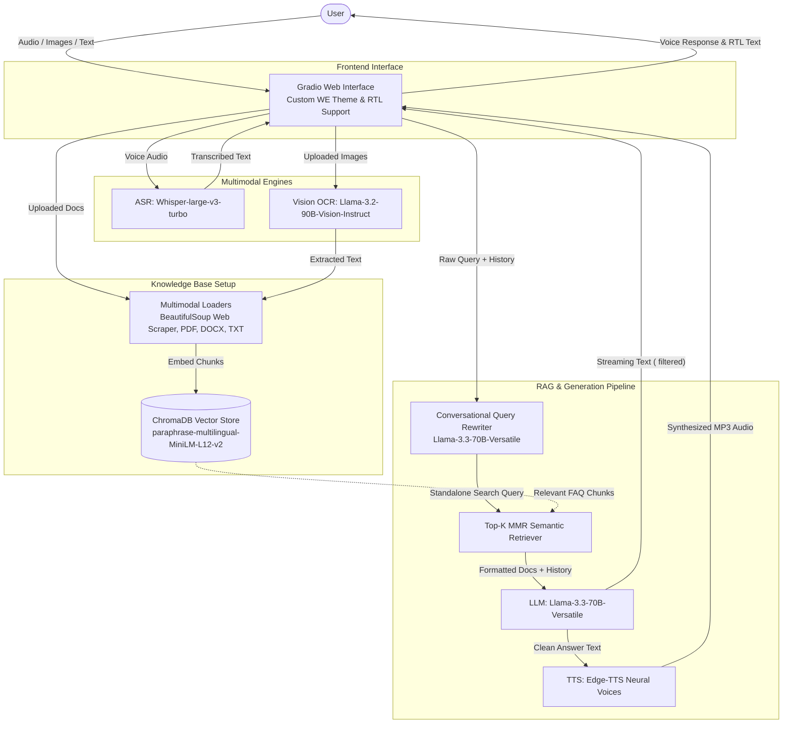

<div align="center">
  <h1>Telecom Egypt Intelligent Assistant</h1>
  <p><strong>A Multimodal RAG & Bilingual Voice Assistant Powered by Groq, LangChain, and Gradio</strong></p>
  <p>
    <a href="https://huggingface.co/spaces/MalakHisham/te-intelligent-assistant"><strong>Try the Live Demo on Hugging Face Spaces</strong></a>
  </p>
</div>

An advanced Retrieval-Augmented Generation (RAG) assistant designed for Telecom Egypt (WE). The system seamlessly processes text, natural voice audio, and scanned document images, retrieves relevant corporate knowledge from ChromaDB using multi-turn query rewriting, and delivers intelligent, natural-sounding voice and text responses in both Egyptian Arabic and English.

---

## Architecture Workflow

The following diagram illustrates the data flow, multimodal document ingestion, conversational query rewriting, and voice/text loop of the assistant:



---

## Key Features

* **Conversational Query Rewriting:** Eliminates multi-turn context loss. The pipeline evaluates conversation history and automatically translates contextual follow-ups (e.g., *"How much is it?"*) into standalone vector search queries (e.g., *"How much is WE Space?"*) before querying ChromaDB.
* **Ultra-Fast Multimodal RAG:** Powered by Groq's `llama-3.3-70b-versatile` for near-instantaneous reasoning, deep step-by-step thinking (`<think>` tag parsing), and accurate context mapping.
* **Bilingual Speech Engine:**
* **Speech-to-Text (ASR):** Leverages `whisper-large-v3-turbo` with domain-specific Egyptian telecom vocabulary prompts (*"This is a customer service conversation. هذه محادثة لخدمة العملاء باللهجة المصرية."*) to capture natural speech without accidental translation.
* **Text-to-Speech (TTS):** Utilizes `edge-tts` with dynamic voice switching for natural-sounding Arabic (`ar-EG-SalmaNeural`) and English (`en-US-AriaNeural`) audio responses.


* **Multimodal Document & Image OCR:**
* Native document loaders for PDF (`pypdf`), DOCX (`docx2txt`), and TXT files.
* Integrated Vision OCR (`llama-3.2-90b-vision-instruct`) to accurately extract bilingual text from scanned documents and images (`.png`, `.jpg`, `.jpeg`).


* **Multilingual Vector Embeddings:** Uses Hugging Face's `sentence-transformers/paraphrase-multilingual-MiniLM-L12-v2` for cross-lingual semantic matching.
* **Strict Language & RTL Mirroring:** Built-in system directives guarantee that English queries receive English responses and Arabic queries receive Arabic responses. The UI dynamically wraps Arabic outputs in Right-to-Left (`<div dir='rtl'>`) HTML containers.
* **Custom Telecom Egypt Branding:** Features a custom Gradio theme (`we_theme`) styled with Telecom Egypt's official purple/indigo color palette and embedded brand logos.

---

## How to Run the Application

You can test the application instantly via the live cloud deployment, run it as a self-contained notebook in Google Colab, or deploy it locally on your machine.

### Option A: Live Demo (Hugging Face Spaces)

The fastest way to experience the assistant is through the live web deployment. No installation or API keys are required.

* **Live Deployment URL:** [MalakHisham/te-intelligent-assistant](https://huggingface.co/spaces/MalakHisham/te-intelligent-assistant)

---

### Option B: Self-Contained Cloud Notebook

The notebook version (`TelecomEgypt_Assistant.ipynb`) is completely self-contained, including all web scrapers, vector database building steps, and an inline Gradio UI.

1. Open `TelecomEgypt_Assistant.ipynb` in **[Google Colab](https://colab.research.google.com/)** or **Kaggle**.
2. Run **Section 1** to install system dependencies (`langchain`, `chromadb`, `edge-tts`, `groq`, `gradio`, etc.).
3. Run **Section 2** and securely paste your free `GROQ_API_KEY` when prompted.
4. Execute sections sequentially from top to bottom. The pipeline will automatically scrape WE FAQ pages and build your local Chroma vector store.
5. In **Section 12**, the Gradio web interface will launch inline inside the notebook alongside a temporary public share link (`https://xxxx.gradio.live`)!

---

### Option C: Local Machine Deployment

To run the script locally on your machine:

1. **Clone the repository & enter the directory:**
```bash
git clone <your-repo-url>
cd TelecomEgypt_intelligent-assistant

```


2. **Create and activate a virtual environment:**
```bash
python3 -m venv venv
source venv/bin/activate  # On Windows use: venv\Scripts\activate

```


3. **Install system audio utilities & Python dependencies:**
Ensure `ffmpeg` is installed on your OS, then run:
```bash
pip install --upgrade pip
pip install gradio langchain langchain-community langchain-huggingface langchain-chroma chromadb sentence-transformers transformers edge-tts pypdf python-docx docx2txt pillow beautifulsoup4 requests langchain-groq groq

```


4. **Set your Groq API Key:**
Obtain a free API key from the [Groq Console](https://console.groq.com/) and set it in your environment:
```bash
export GROQ_API_KEY="your_actual_api_key_here"  # On Windows CMD use: set GROQ_API_KEY="..."

```


5. **Start the application:**
```bash
python app.py

```


Open your browser to `http://127.0.0.1:7860` to record voice notes, attach documents, and chat with the assistant!
