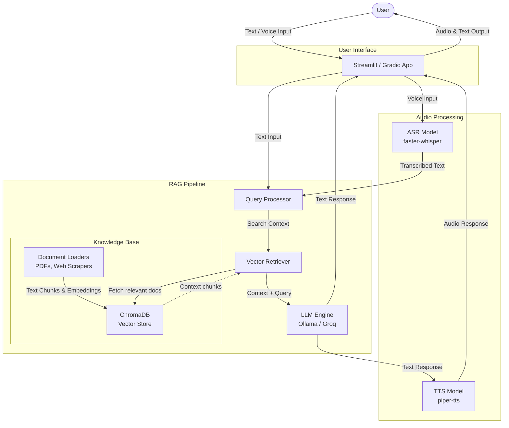

<div align="center">
  
  <h1>Telecom Egypt Intelligent Assistant</h1>
</div>

An advanced Retrieval-Augmented Generation (RAG) assistant designed for Telecom Egypt. The system seamlessly processes both text and voice inputs (including Egyptian Arabic), retrieves relevant organizational context, and provides intelligent, natural-sounding voice and text responses.

## 🏗️ Architecture Workflow

The following diagram illustrates the data flow and system architecture of the intelligent assistant:



## ✨ Features
- **Multimodal Inputs & Outputs:** Supports text chat and direct microphone recordings.
- **Dialect-Aware ASR:** Employs `faster-whisper` for accurate Egyptian Arabic and English code-switching transcriptions.
- **Offline TTS:** Utilizes `piper-tts` for high-quality, localized Arabic text-to-speech generation.
- **Advanced RAG Architecture:** Integrates `LangChain`, `ChromaDB`, and LLMs for context-aware answering from uploaded internal documents.
- **Dual Deployment Options:** Run completely locally with Streamlit & Ollama, or run on the cloud via Colab with Gradio & Groq API.

## 🚀 How to Run the App

You have two main options to run the assistant depending on your resource constraints.

### Option A: Local Streamlit App (using Ollama)
This is the completely local version of the app. It requires a machine with decent RAM (8GB+ minimum).

1. **Clone the repository:**
   ```bash
   git clone <your-repo-url>
   cd TelecomEgypt_intelligent-assistant
   ```
2. **Create and activate a virtual environment:**
   ```bash
   python3 -m venv venv
   source venv/bin/activate  # On Windows use: venv\Scripts\activate
   ```
3. **Install dependencies:**
   ```bash
   pip install -r requirements.txt
   ```
4. **Install & Run Ollama:** Ensure [Ollama](https://ollama.com/) is installed and running locally. Pull the required model:
   ```bash
   ollama pull qwen2.5:0.5b
   ```
5. **Start the application:**
   ```bash
   streamlit run app.py
   ```
6. Open your browser and navigate to the local URL (usually `http://localhost:8501`). Upload your PDFs/Docs via the **Knowledge Base** sidebar to train the assistant!

### Option B: Self-Contained Notebook (using Groq API)
If you are short on local hardware resources, you can run the provided self-contained notebook on Google Colab or Kaggle. It utilizes the ultra-fast Groq API and a Gradio interface.

1. Open `TelecomEgypt_Assistant.ipynb` in [Google Colab](https://colab.research.google.com/) or Jupyter.
2. Obtain a free API key from the [Groq Console](https://console.groq.com/).
3. Follow the steps inside the notebook:
   - Install dependencies.
   - Enter your Groq API key when prompted.
   - Run the cells sequentially to ingest documents and launch the **Gradio** web interface directly within the notebook!

---

### 📝 Developer Drafts & Notes
*(Kept for future documentation and presentation building)*

**Challenges I faced through building this project:**
1. First time to use ASR, TTS, OCR models
2. Web Scraping
3. Complex RAG architecture
4. Different input and different output capabilities needed
5. Arabic and Egyptian supported models

**Don't forget to:**
1. Make the ppt
2. Make readme (Done)
3. Diagram and workflow (Done)

**Why not use:**
1. Colab -> somewhat hard as notebooks cannot talk to each other easily; scripts are easier to manage and modularize. *(Note: A self-contained notebook version was later added to mitigate this!)*
2. More advanced models -> resource limitations and complexity (RAM, GPU), I want to run locally.