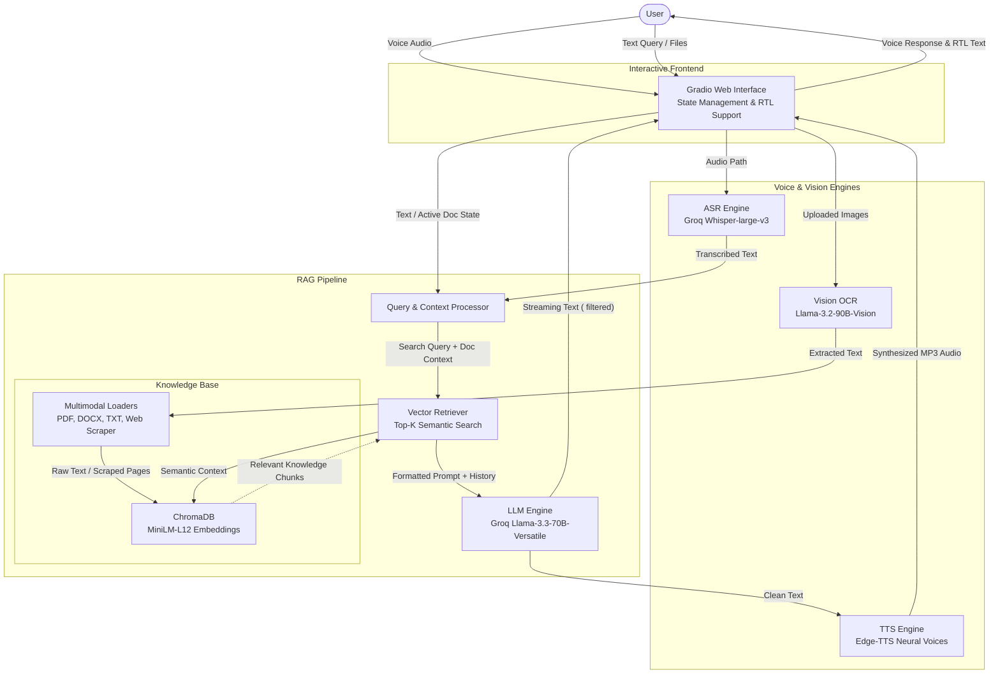

<div align="center">
  <h1>Telecom Egypt Intelligent Assistant</h1>
  <p><strong>A Multimodal RAG & Bilingual Voice Assistant Powered by Groq, LangChain, and Gradio</strong></p>
</div>

An advanced Retrieval-Augmented Generation (RAG) assistant designed for Telecom Egypt (WE). The system seamlessly processes text, natural voice audio, and scanned document images, retrieves relevant corporate knowledge from ChromaDB, and delivers intelligent, natural-sounding voice and text responses in both Egyptian Arabic and English.

---

## 🏗️ Architecture Workflow

The following diagram illustrates the data flow, multimodal document ingestion, and voice/text conversational loop of the assistant:



---

## ✨ Key Features

* **Ultra-Fast Multimodal RAG:** Powered by Groq's `llama-3.3-70b-versatile` for near-instantaneous reasoning, deep step-by-step thinking (`<think>` tag parsing), and accurate context mapping.
* **Bilingual Speech Engine:**
* **Speech-to-Text (ASR):** Leverages `whisper-large-v3` with domain-specific Egyptian telecom vocabulary prompts to capture natural speech and code-switching without accidental translation.
* **Text-to-Speech (TTS):** Utilizes `edge-tts` with dynamic voice switching for natural-sounding Arabic (`ar-EG-SalmaNeural`) and English (`en-US-AriaNeural`) audio responses.


* **Multimodal Document & Image OCR:**
* Native loaders for PDF (with an unbreakable direct `pypdf` fallback), DOCX, and TXT files.
* Integrated Vision OCR (`llama-3.2-90b-vision-preview`) to accurately extract text from scanned documents and images (`.png`, `.jpg`, `.jpeg`).


* **Strict Language Mirroring:** Built-in system directives guarantee that English queries receive English responses and Arabic queries receive Arabic responses, regardless of the background retrieval language.
* **Persistent Document Memory:** Uses Gradio `gr.State()` to maintain uploaded document context across multi-turn conversational threads without losing memory.

---

## 🚀 How to Run the Application

You can run this project locally as a standalone Python web application or execute it in the cloud via Google Colab.

### Option A: Local Gradio Deployment / Hugging Face Spaces

This runs the production-ready script (`app.py`) locally on your machine.

1. **Clone the repository & enter the directory:**
```bash
git clone <your-repo-url>
cd TelecomEgypt_intelligent-assistant

```


2. **Create and activate a virtual environment:**
```bash
python3 -m venv venv
source venv/bin/activate  # On Windows use: venv\Scripts\activate

```


3. **Install system audio utilities & Python dependencies:**
Make sure `ffmpeg` is installed on your system (`sudo apt install ffmpeg` on Linux, or via Homebrew/Chocolatey), then install the Python packages:
```bash
pip install --upgrade pip
pip install gradio langchain langchain-community langchain-huggingface langchain-chroma chromadb sentence-transformers transformers edge-tts pypdf python-docx docx2txt pillow beautifulsoup4 requests langchain-groq groq

```


4. **Set your Groq API Key:**
Obtain a free API key from the [Groq Console](https://console.groq.com/) and set it in your environment:
```bash
export GROQ_API_KEY="your_actual_api_key_here"  # On Windows CMD use: set GROQ_API_KEY="..."

```


5. **Start the application:**
```bash
python app.py

```


Open your browser to `http://127.0.0.1:7860` to record voice notes, attach documents, and chat with the assistant!

---

### Option B: Self-Contained Google Colab Notebook

If you want to bypass local hardware setup, use the self-contained notebook version. It includes all scrapers, vector DB building steps, and an inline Gradio UI.

1. Open `TelecomEgypt_Assistant.ipynb` in [Google Colab](https://colab.research.google.com/) or Jupyter Notebook.
2. Run **Section 1** to install dependencies.
3. Run **Section 2** and paste your `GROQ_API_KEY` into the secure input prompt.
4. Execute the remaining cells sequentially from top to bottom.
5. In **Section 12**, the Gradio web interface will launch inline inside the notebook cell alongside a temporary public share link!

---

## 🧠 Technical Challenges & Architectural Decisions

*This section documents key engineering decisions and hurdles overcome during development, serving as an outline for technical presentations and project documentation.*

### 1. Navigating Multimodal Voice & Vision Pipelines

* **Challenge:** Integrating speech-to-text, text-to-speech, and image OCR into a single chat interface without creating massive latency bottlenecks or formatting crashes.
* **Solution:** Used Groq's cloud LPU inference for instant Whisper ASR and Llama Vision OCR, paired with lightweight local `edge-tts` to generate speech audio asynchronously without blocking the UI thread.

### 2. Preventing Dialect Hallucination & Accidental Translation

* **Challenge:** Standard speech models frequently mistranscribe Egyptian Arabic or automatically translate spoken English into Arabic when background database context is heavy in Arabic.
* **Solution:** Removed hardcoded language locks in Whisper, injected a bilingual telecom vocabulary anchor into the ASR prompt, and engineered a **Strict Language Directive** into the LLM system prompt to force exact language mirroring.

### 3. State Management & Multi-Turn File Uploads

* **Challenge:** Web UI frameworks often lose track of uploaded file content during consecutive chat turns, or crash when different file payload types (dicts vs. filepaths) are passed.
* **Solution:** Engineered a custom path-normalization function (`get_clean_path`), built a fallback PDF extractor using `pypdf`, and implemented Gradio `gr.State()` to persist active document text seamlessly across conversational turns.

### 4. Architectural Evolution: Scripts vs. Notebooks

* **Decision:** Initial prototypes faced limitations inside standard notebooks due to memory constraints and complex inter-cell communication. The project evolved into a modular, standalone script (`app.py`) for clean Hugging Face Spaces deployment, while retaining a synchronized, self-contained notebook version for quick cloud demonstrations and testing.
  
